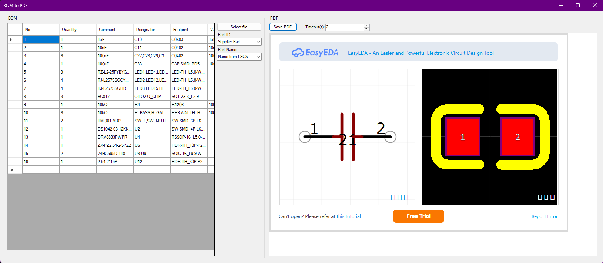
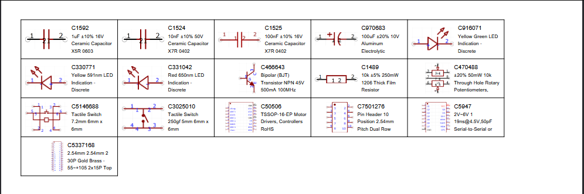

# BOMToPDF

**BOMToPDF** is a tool designed for engineers and electronics hobbyists to:

- Load a **BOM (Bill of Materials)** from EasyEDA or other PCB editor.
- Automatically **fetch component descriptions from LCSC**.  
- Download and render **JLCPCB footprints**.  
- Generate **printable PDF labels** for components.

---

## Features

- Supports Excel `.xlsx` files.  
- Integrates with **LCSC** to fetch component names.  
- Integrates with **JLCPCB** to fetch footprints and convert SVG → PNG.  
- PDF labels layout:  
  - **Left column**: footprint image (automatically fits and aligned right).  
  - **Right column**: two text rows – component ID and Name.  
- Automatically adjusts rows and columns to fit **A4 page** size.

---

## Installation

1. Download **BOMToPDF.exe** or build from Visual Studio.  
2. Prepare an Excel BOM file:  
   - One column for **LCSC IDs**.  
   - Another column for **component names** (if not using the scraper).  
3. Run the application and select the Excel file.  
4. Choose options for:  
   - Using LCSC scraper.  
   - Downloading JLCPCB footprints.  

---

## Usage

1. Launch the application.  
2. Select your BOM Excel file.  
3. Confirm options for LCSC / JLCPCB.  
4. Wait while data and footprints are fetched.  
5. Save the resulting PDF with labels.

---

## Notes

- **JLCPCB footprints** require an internet connection.  
- If a footprint cannot be downloaded, a **ERROR** text is used.  

---

## Screenshots

---

## License

BSD 2-Clause License (Free to use, modify, and distribute)

